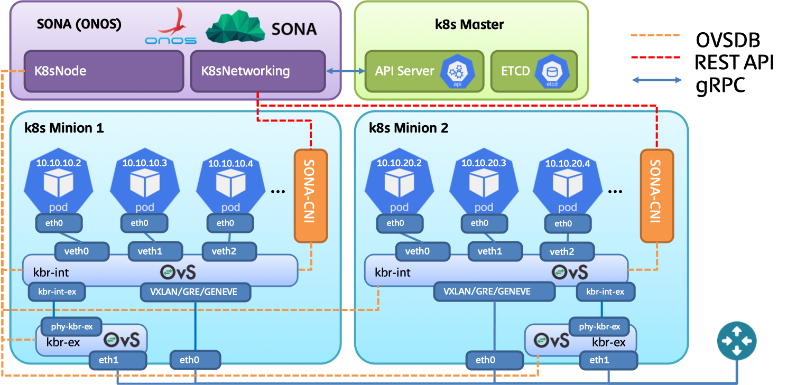

# Introduction to SONA-CNI

This tutorial shows the details instructions on installing kubernetes with SONA-CNI. The target OS used in this tutorial is CentOS. We will use three nodes to construct environment, one node behaves as a kubernetes master node where ONOS will be installed, while the others two nodes behave as kubernetes worker (minion) nodes. Note that OpenvSwitch (OVS) will be installed in all three nodes to ensure the inter-node connectivity.
The network topology used in this tutorial is depicted in the following figure. Two networks will be used for this deployment. 
* Management and overlay tunneling network: this network will be used to access host machine from outside of the world, also this network will be used to provide tunnels among host machines.
* NodeIP + South to North traffic network: this network will be used to access kubernetes POD via NodeIP, also traffic initiated from POD and destined to internet will go through this network. Note that this network will be directly attached to OpenvSwitch (OVS)'s bridge; therefore, it should not be used for inter-host communication.
In case the host machines lack of network interfaces, it would be fine to merge management and overlay tunneling network. So we need to have two network interfaces at least in order to run kubernetes with SONA-CNI.

