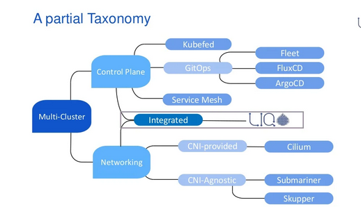
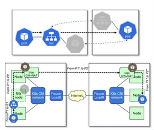

# Kubernetes federation:

There are several SaaS and open-source solutions that have the capability to manage multiple, disparate Kubernetes clusters – regardless of the specific distribution or what hosted offering is in play – as long as it is a certified Kubernetes platform. Kubernetes multi-cluster management focuses broadly on giving a single view to interact with, and report on each and every separate cluster under management.

Kubernetes Federation takes this concept of multi-cluster management a step further, and introduces the capabilities to have a master configuration that is managed through a single API in the host cluster, and have all or part of that configuration applied to any clusters that are members of the federation.

## Kubernetes Multi-cluster vs. Multi-tenant vs. Federation

In the world of Kubernetes, there are some concepts which are similar, and can share some features but are distinct deployment models. The most basic deployment model is of a single cluster that is used by one development team where no partitioning of any kind is needed. Multi-cluster management is the ability to gain visibility and control over many of these separate custers. While single-cluster deployment this is the easiest deployment path, it is not the best use of compute resources as it requires having all of the overhead associated with a cluster for each and every team/use. This is amplified when security and quality assurance teams also want their own place to test and deploy the same applications.

Kubernetes Multi-tenancy is the ability to have multiple distinct areas (usually namespaces) within a single cluster where quotas and security policies can be applied at the boundaries to improve overall resource utilization and simplify the overall infrastructure required to support an environment.

There are times where you still need to have multiple separate clusters in play whether it is to separate development and production, run sensitive workloads, or even across multiple data centers. This scenario can still have multi-tenancy in some or all of the clusters, but it has become a multi-cluster deployment. Multi-cluster management allows for a single interface which can see and control aspects of every cluster that is connected to the multi-cluster management plane.

Kubernetes Federation extends some attributes Multi-cluster, but does not cover all the multi-cluster scenarios. When multiple clusters are federated then they actually share pieces of their configuration which is managed by what is called the host cluster and sent to the member clusters of the federation. The benefit of having the high order parts of a configuration shared is that any resources configured to take advantage of the federation will treat all member clusters as a single distributed cluster with oversight by the host cluster.

## Common uses for Kubernetes federation

One of the most common scenarios where Federation is desirable is to scale an application across multiple data centers. The application is packaged in a deployment which is set to leverage the federation and it equally spreads out its desired number of replicas across worker nodes in all the member clusters. Since not all the configuration has to be pushed from the host to all members, it  allows for local variables in each member cluster to be supplemental to the federated configuration. With this, you can accommodate cluster-specific things like domain names and network policies that can be different per environment.

## History of Kubernetes Federation

Kubernetes Federation is an approach released and managed by the multicluster Special Interest Group (SIG) under the umbrella of the Kubernetes project in the CNCF. Version 1 of the standard was originally maintained by the core Kubernetes team when it was released in Kubernetes 1.5 version until about version 1.8, at which point it was transitioned to the SIG. The SIG realized the approach wasn’t in line with how configuration management was moving in the main Kubernetes distributions and started working on version 2, which is a complete rewrite – currently in beta – and works on Kubernetes versions 1.13 and newer.

Kubernetes Federation v2 is referred to as “KubeFed,” and it supports a new standard approach that leverages commonly-used components in Kubernetes, like CRDs. The SIG has a kubefedctl CLI tool in early stages of development on GitHub that will manage the configuration within a federation.
## The basic architecture of Kubernetes Federation

The core concept behind Kubernetes Federation is the host cluster that contains any configuration that will be propagated to the member clusters. The host cluster can be a member and run real workloads too, but typically organizations will have the host cluster as a standalone cluster for simplicity.

All cluster-wide configurations are handled through a single API, and define both what is in scope of the federation and what clusters that piece of configuration will be pushed too. The details of what is included in the federated configuration are defined by a series of templates, policies, and cluster-specific overrides.

The federated configuration manages the DNS entries for any multi-cluster services in addition to needing access to all the member clusters to create, apply, and remove any configuration items including deployments. Typically every deployment will have its own namespace, which will be consistent across the member clusters.

