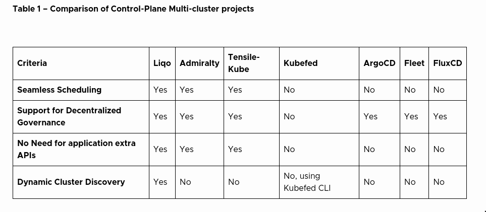
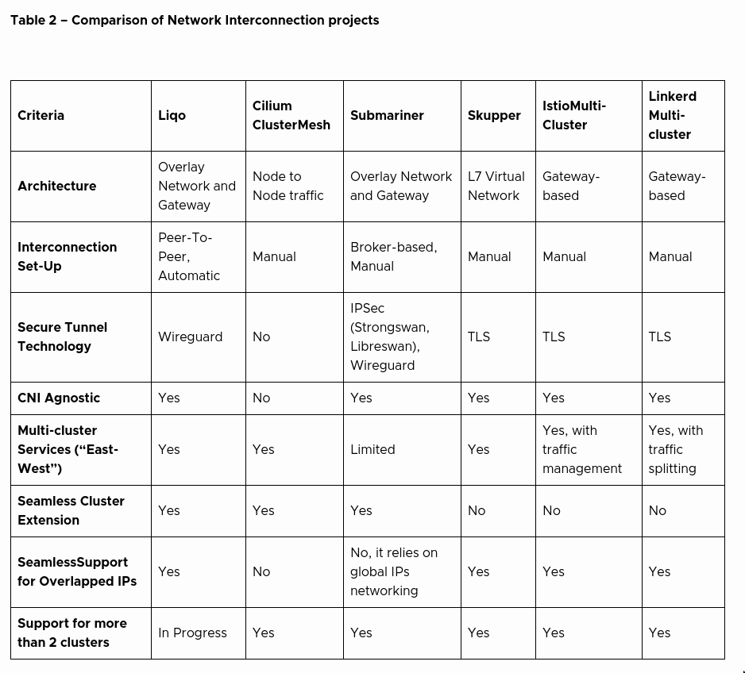

# LIQO

## Liqo Network Fabric

The fundamental principle of Liqo networking is to maintain the basic functioning of single-cluster networking. In particular, the main focus preserves direct pod-to-pod traffic, enabling a transparent extension from the user’s perspective. Pods discovered as service endpoints can be reached even if they are on another cluster or their address collides with the “home” cluster pod address space.

Under the hoods, cluster interconnection is established using an overlay network to route traffic to remote clusters. Liqo leverages a “gateway” pod that connects to the remote peer using Wireguard. This architecture prevents the requirements, such as in CiliumMesh, to have all the nodes of participating clusters completely reachable from the other cluster. In addition, Liqo also handles possible overlapped pod IP addresses, taking them via double natting.

Liqo is mainly independent of the CNIs of connected clusters or compatible POD CIDRs. CNIs can be chosen independently, and, moreover, Liqo also supports managed clusters (i.e., AKS, GKE) and their networking architecture.

## Liqo Resource Sharing

After the peering has occurred, a new node is added to the cluster. This virtual node will describe the amount of CPU and memory of another cluster available for scheduling.  The vanilla Kubernetes scheduler can directly assign pods to this created node. The peering process defines which size the node should have and introduces de facto the possibility of decentralized governance. Cluster admins can tweak the number of exposed resources to the other clusters.

Using Liqo, there is no disruption for the user-facing Kubernetes. For example, when a user deploys an application on a Liqo-labelled namespace, the namespace content is reflected in a twin namespace on the other cluster. More precisely, inside the “twin” namespace, most of the k8s objects are replicated on the remote one. This enables a pod to transparently be executed remotely and access its configuration objects.

This is particularly interesting for service reflection, which implements multi-cluster services “East-West.” Pods can access services anywhere in the multi-cluster topology. Under the hoods, service endpoints are manipulated by Liqo VK, crafted to also consider NAT translation.

Finally, Liqo pod offloading is split-brain tolerant. When Pods are offloaded on the remote cluster, they are wrapped in a replicaset object. This way, the offloaded pod states continue to be correctly reconciled on the remote cluster even if the connection with the originating cluster is lost.
