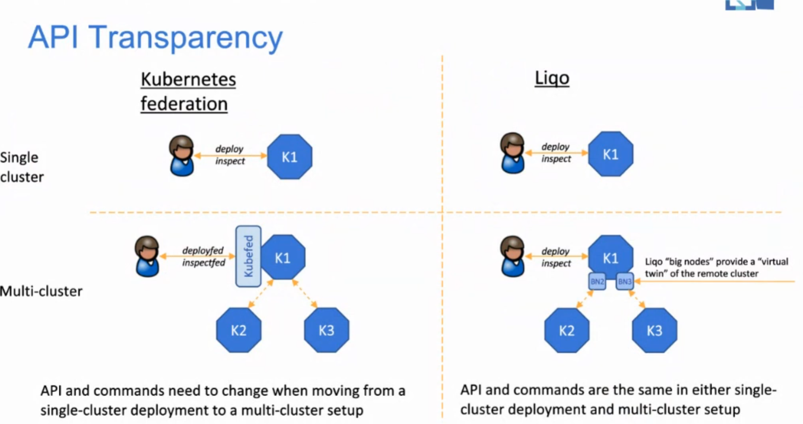
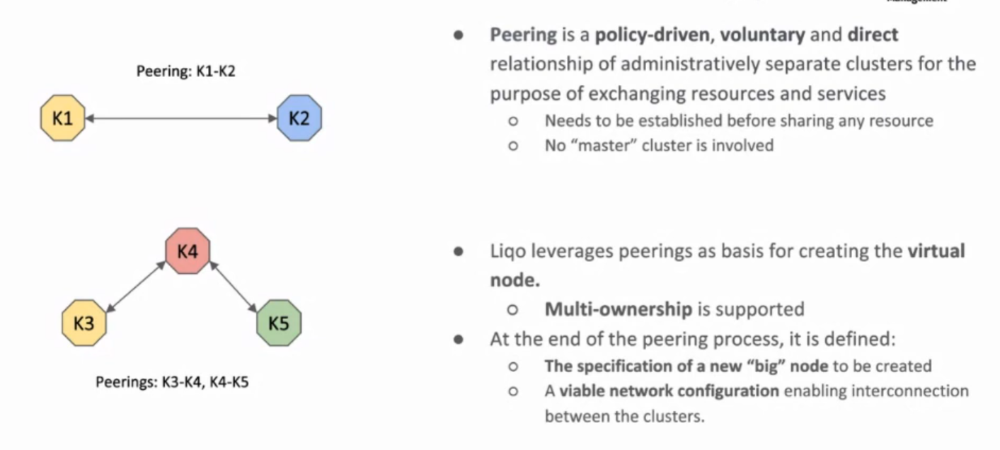
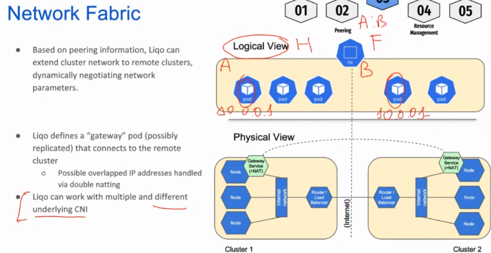
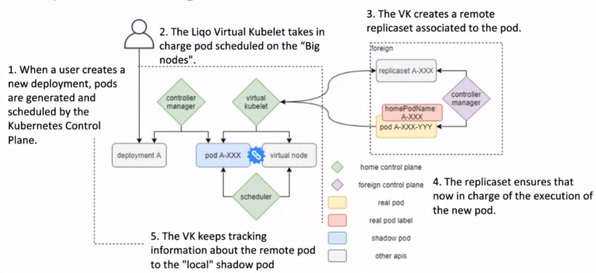
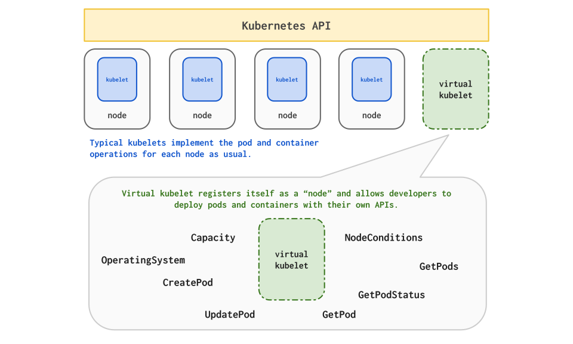
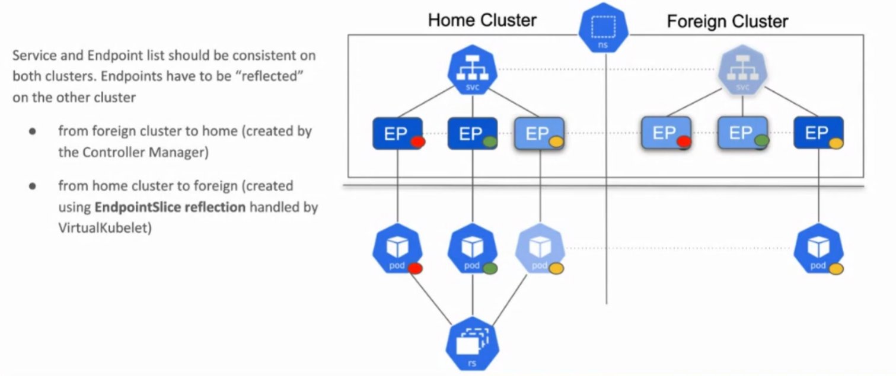
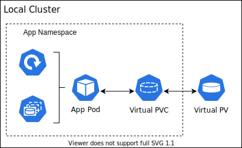
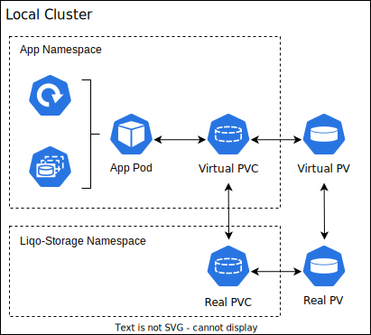
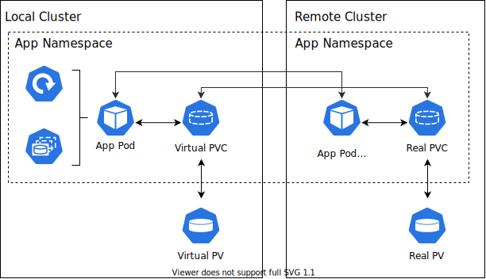

# LIQO

## API Trasparency

## Liqo cluster management

1. Discovery available clusters
2. Peering with other clusters and negotiate parameters
3. Establish a network interconnection 
4. Create virtual node
5. Offload pods

## Peering

No MASTER INVOLVED! Completely peer-to-peer protocol.

## Network fabric

Dove:

* H is the home cluster

* F is the foreign cluster

* A is the home cluster namespace

* B is the foreign cluster namespace

## Workload offloading

Workload offloading is enabled by the virtual node abstraction. A virtual node is spawned at the end of the peering process in the local (i.e., consumer) cluster, and represents (and aggregates) the subset of resources shared by the remote cluster. This solution enables the transparent extension of the local cluster, with the new node (and its capabilities) seamlessly taken into account by the vanilla Kubernetes scheduler when selecting the best place for the workloads execution. At the same time, this approach is fully compliant with the standard Kubernetes APIs, hence allowing to interact with and inspect offloaded pods just as if they were executed locally.

The replicaset is necessary because if the virtual kubelet crash, then no one is able to recreate or restart the pod in the foreign cluster.

### Virtual kubelet

The virtual node abstraction is implemented by an extended version of the Virtual Kubelet project. A virtual kubelet replaces a traditional kubelet when the controlled entity is not a physical node. In the context of Liqo, it interacts with both the local and the remote clusters (i.e., the respective Kubernetes API servers) to:

* Create the virtual node resource and reconcile its status with respect to the negotiated configuration.

* Offload the local pods scheduled onto the corresponding (virtual) node to the remote cluster, while keeping their status aligned.

* Propagate and synchronize the accessory artifacts (e.g., Services, ConfigMaps, Secrets, …) required for proper execution of the offloaded workloads, a feature we call resource reflection.

For each remote cluster, a different instance of the Liqo virtual kubelet is started in the local cluster, ensuring isolation and segregating the different authentication tokens.

However, it should be noted that VK is explicitly not intended to be an alternative to Kubernetes federation.

#### How it is used in Liqo

Liqo implements a provider for Virtual Kubelet designed to transparently offload pods and services to "peered" Kubernetes remote cluster. Liqo is capable of discovering neighbor clusters (using DNS, mDNS) and "peer" with them, or in other words, establish a relationship to share part of the cluster resources. When a cluster has established a peering, a new instance of the Liqo Virtual Kubelet is spawned to seamlessly extend the capacity of the cluster, by providing an abstraction of the resources of the remote cluster. The provider combined with the Liqo network fabric extends the cluster networking by enabling Pod-to-Pod traffic and multi-cluster east-west services, supporting endpoints on both clusters.Liqo Provider

Liqo implements a provider for Virtual Kubelet designed to transparently offload pods and services to "peered" Kubernetes remote cluster. Liqo is capable of discovering neighbor clusters (using DNS, mDNS) and "peer" with them, or in other words, establish a relationship to share part of the cluster resources. When a cluster has established a peering, a new instance of the Liqo Virtual Kubelet is spawned to seamlessly extend the capacity of the cluster, by providing an abstraction of the resources of the remote cluster. The provider combined with the Liqo network fabric extends the cluster networking by enabling Pod-to-Pod traffic and multi-cluster east-west services, supporting endpoints on both clusters.

### Virtual node

A virtual node summarizes and abstracts the amount of resources (e.g., CPU, memory, …) shared by a given remote cluster. Specifically, the virtual kubelet automatically propagates the negotiated configuration into the capacity and allocatable entries of the node status.

Node conditions reflect the current status of the node, with periodic and configurable healthiness checks performed by the virtual kubelet to assess the reachability of the remote API server. This allows to mark the node as not ready in case of repeated failures, triggering the standard Kubernetes eviction strategies based on the configured pod tolerations (e.g., to enforce service continuity).

Finally, each virtual node includes a set of characterizing labels (e.g., geographical region, underlying provider, …) suggested by the remote cluster. This enables the enforcement of fine-grained scheduling policies (e.g., through affinity constraints), in addition to playing a key role in the namespace extension process presented below.

### Namespace extension

To enable seamless workload offloading, Liqo extends Kubernetes namespaces across the cluster boundaries. Specifically, once a given namespace is selected for offloading (see the namespace offloading usage section for the operational procedure), Liqo proceeds with the automatic creation of twin namespaces in the subset of selected remote clusters.

Remote namespaces host the actual pods offloaded to the corresponding cluster, as well as the additional resources propagated by the resource reflection process. This behavior is presented in the figure below, which shows a given namespace existing in the local cluster and extended to a remote cluster. A group of pods is contained in the local namespace, while a subset (i.e., those faded-out) is scheduled onto the virtual node and offloaded to the remote namespace. Additionally, the resource reflection process propagated different resources existing in the local namespace (e.g., Services, ConfigMaps, Secrets, …) in the remote one (represented faded-out), to ensure the correct execution of offloaded pods.

The Liqo namespace extension process features a high degree of customization, mainly enabling to:

* Select a specific subset of the available remote clusters, by means of standard selectors matching the label assigned to the virtual nodes.

* Constraint whether pods should be scheduled onto physical nodes only, virtual nodes only, or both. The extension of a namespace, forcing at the same time all pods to be scheduled locally, enables the consumption of local services from the remote cluster, as shown in the service offloading example.

* Configure whether the remote namespace name should match the local one (although possibly incurring in conflicts), or be automatically generated, such as to be unique.

### Pod offloading

Once a pod is scheduled onto a virtual node, the corresponding Liqo virtual kubelet (indirectly) creates a twin pod object in the remote cluster for actual execution. Liqo supports the offloading of both stateless and stateful pods, the latter either relying on the provided storage fabric or leveraging externally managed solutions (e.g., persistent volumes provided by the cloud provider infrastructure).

Remote pod resiliency (hence, service continuity), even in case of temporary connectivity loss between the two control planes, is ensured through a custom resource (i.e., ShadowPod) wrapping the pod definition, and triggering a Liqo enforcement logic running in the remote cluster. This guarantees that the desired pod is always present, without requiring the intervention of the originating cluster.

The virtual kubelet takes care of the automatic propagation of remote status changes to the corresponding local pod (remapping the appropriate information), allowing for complete observability from the local cluster. Advanced operations, such as metrics and logs retrieval, as well as interactive command execution inside remote containers, are transparently supported, to comply with standard troubleshooting operations.

#### Resource reflection (aka pod offloading)

The resource reflection process is responsible for the propagation and synchronization of selected control plane information into remote clusters, to enable the seamless execution of offloaded pods. Liqo supports the reflection of the resources dealing with service exposition (i.e., Ingresses, Services and EndpointSlices), persistent storage (i.e., PersistentVolumeClaims and PersistentVolumes), as well as those storing configuration data (i.e., ConfigMaps and Secrets).

All resources of the above types that live in a namespace selected for offloading are automatically propagated into the corresponding twin namespaces created in the selected remote clusters. Specifically, the local copy of each resource is the source of trust leveraged to realign the content of the shadow copy reflected remotely. Appropriate remapping of certain information (e.g., endpoint IPs) is transparently performed by the virtual kubelet, accounting for conflicts and different configurations in different clusters.

Briefly, the set of supported resources includes (by category):

* Workload: Pods

* Exposition: Services, EndpointSlices, Ingresses

* Storage: PersistentVolumeClaims, PresistentVolumes

* Configuration: ConfigMaps, Secrets

#### Details about resource reflection

Liqo leverages a custom resource, named ShadowPod, combined with an appropriate enforcement logic to ensure remote pod resiliency even in case of temporary connectivity loss between the local and remote clusters.

Pod specifications are propagated to the remote cluster verbatim, except for the following fields that are mutated:

* Removal of scheduling constraints (e.g., Affinity, NodeSelector, SchedulerName, Preemption, …), as referring to the local cluster.

* Mutation of service account related information, to allow offloaded pods to transparently interact with the local (i.e., origin) API server, instead of the remote one.

* Enforcement of the properties concerning the usage of host namespaces (e.g., network, IPC, PID) to false (i.e., disabled), as potentially invasive and troublesome.

Differently, pod status is propagated from the remote cluster to the local one, performing the following modifications:

* The PodIP is remapped according to the network fabric configuration, such as to be reachable from the other pods running in the same cluster.

* The NodeIP is replaced with the one of the corresponding virtual kubelet pod.

* The number of container restarts is augmented to account for the possible deletions of the remote pod (whose presence is enforced by the controlling ShadowPod resource).

##### Service exposition

The reflection of Service and EndpointSlice resources is a key element to allow the seamless intercommunication between microservices spread across multiple clusters, enabling the usage of standard DNS discovery mechanisms. In addition, the propagation of Ingresses enables the definition of multiple points of entrance for the external traffic, especially when combined with additional tools such as K8GB (see the global ingress example for additional details).

In this case 2 pods are scheduled on the home cluster, and one pod is scheduled on the foreign cluster.

###### Services 

Services are reflected verbatim into remote clusters, except for what concerns the ClusterIP, LoadBalancerIP and NodePort fields (when applicable), which are left empty (hence defaulted by the remote cluster), as likely conflicting. Still, the usage of standard DNS discovery mechanisms (i.e., based on service name/namespace) abstracts away the ClusterIP differences, with each pod retrieving the correct IP address.

###### EndpointSlices

In the local cluster, Services are transparently handled by the vanilla Kubernetes control plane, since it has full visibility of all pods (even those offloaded), hence leading to the creation of the corresponding EndpointSlice entries. Differently, the control plane of each remote cluster perceives only the pods running in that cluster, and the standard EndpointSlice creation logic alone is not sufficient (as it would not include the pods hosted by other clusters).

This gap is filled by the Liqo EndpointSlice reflection logic, which takes care of propagating all EndpointSlice entries (i.e. endpoints) not already present in the destination cluster. During the propagation process, endpoint addresses are appropriately remapped according to the network fabric configuration, ensuring that the resulting IPs are reachable from the destination cluster.

Thanks to this approach, multiple replicas of the same microservice spread across different clusters, and backed by the same service, are handled transparently. Each pod, no matter where it is located, contributes with a distinct EndpointSlice entry, either by the standard control plane or through resource reflection, hence becoming eligible during the Service load-balancing process.

###### Ingresses

The propagation of Ingress resources enables the configuration of multiple points of entrance for external traffic. Ingress resources are propagated verbatim into remote clusters, except for the IngressClassName field, which is left empty. Hence, selecting the default ingress class in the remote cluster, as the local one (i.e., the one in the origin cluster) might not be present.

##### Persistent storage

The reflection of PersistentVolumeClaims (PVCs) and PersistentVolumes (PVs) is a key to enable the cross-cluster Liqo storage fabric. Specifically, the process is triggered when a PVC requiring the Liqo storage class is bound for the first time, and the requesting pod is scheduled in a virtual node (i.e., remote cluster). Upon this event, the PVC is propagated verbatim to the remote cluster, replacing the requested StorageClass with the one negotiated during the peering process.

Once created, the resulting PV is reflected backwards (i.e., from the remote to the local cluster), and the proper affinity selectors are added to bind it to the virtual node. Hence, subsequent pods mounting that PV will be scheduled on that virtual node, and eventually offloaded to the same remote cluster.

## Network fabric

The network fabric is the Liqo subsystem transparently extending the Kubernetes network model across multiple independent clusters, such that offloaded pods can communicate with each other as if they were all executed locally.

In detail, the network fabric ensures that all pods in a given cluster can communicate with all pods on all remote peered clusters, either with or without NAT translation. The support for arbitrary clusters, with different parameters and components (e.g., CNI plugins), makes it impossible to guarantee non-overlapping pod IP address ranges (i.e., PodCIDR). Hence, possibly requiring address translation mechanisms, provided that NAT-less communication is preferred whenever address ranges are disjointed.

The figure below represents at a high level the network fabric established between two clusters, with its main components detailed in the following.

### Network manager

The network manager (not shown in figure) represents the control plane of the Liqo network fabric. It is executed as a pod, and it is responsible for the negotiation of the connection parameters with each remote cluster during the peering process.

It features an IP Address Management (IPAM) plugin, which deals with possible network conflicts through the definition of high-level NAT rules (enforced by the data plane components). Additionally, it exposes an interface consumed by the reflection logic to handle IP addresses remapping. Specifically, this is leveraged to handle the translation of pod IPs (i.e., during the synchronization process from the remote to the local cluster), as well as during EndpointSlices reflection (i.e., propagated from the local to the remote cluster).

### Cross-cluster VPN tunnels

The interconnection between peered clusters is implemented through secure VPN tunnels, made with WireGuard, which are dynamically established at the end of the peering process, based on the negotiated parameters.

Tunnels are set up by the Liqo gateway, a component of the network fabric that is executed as a privileged pod on one of the cluster nodes. Additionally, it appropriately populates the routing table, and configures, by leveraging iptables, the NAT rules requested to comply with address conflicts.

Although this component is executed in the host network, it relies on a separate network namespace and policy routing to ensure isolation and prevent conflicts with the existing Kubernetes CNI plugin. Moreover, active/standby high-availability is supported, to ensure minimum downtime in case the main replica is restarted.

### In-cluster overlay network

The overlay network is leveraged to forward all traffic originating from local pods/nodes, and directed to a remote cluster, to the gateway, where it will enter the VPN tunnel. The same process occurs on the other side, with the traffic that exits from the VPN tunnel entering the overlay network to reach the node hosting the destination pod.

Liqo leverages a VXLAN-based setup, which is configured by a network fabric component executed on all physical nodes of the cluster (i.e., as a DaemonSet). Additionally, it is also responsible for the population of the appropriate routing entries to ensure correct traffic forwarding.

## Storage Fabric

The Liqo storage fabric subsystem enables the seamless offloading of stateful workloads to remote clusters. The solution is based on two main pillars:

* Storage binding deferral until its first consumer is scheduled onto a given cluster (either local or remote). This ensures that new storage pools are created in the exact location where their associated pods have just been scheduled onto for execution.

* Data gravity, entering in action in the subsequent scheduling processes, and involving a set of automatic policies to attract pods in the appropriate cluster. This guarantees that pods requesting existing pools of storage (e.g., following a restart) are scheduled onto the cluster physically hosting the corresponding data.

These approaches extend standard Kubernetes practice to multi-cluster scenarios, simplifying at the same time the configuration of high availability and disaster recovery scenarios. To this end, one relevant use-case is represented by database instances that need to be replicated and synchronized across different clusters, which is shown in the stateful applications example.

Under the hood, the Liqo storage fabric leverages a virtual storage class, which embeds the logic to create the appropriate storage pools in the different clusters. Whenever a new PersistentVolumeClaim (PVC) associated with the virtual storage class is created, and its consumer is bound to a (possibly virtual) node, the Liqo logic goes into action, based on the target node:

* If it is a local node, PVC operations are remapped to a second one, associated with the corresponding real storage class, to transparently provision the requested volume.

* In case of virtual nodes, the reflection logic is responsible for creating the remote shadow PVC, remapped to the negotiated storage class, and synchronizing the PersistentVolume information, to allow pod binding.

In both cases, locality constraints are automatically embedded within the resulting PersistentVolumes (PVs), to make sure each pod is scheduled only onto the cluster where the associated storage pools are available.

Additional details about the configuration of the Liqo storage fabric, as well as concerning the possibility to move storage pools among clusters through the Liqo CLI tool, are presented in the stateful applications usage section.

### Liqo virtual storage class

The Liqo virtual storage class is a Storage Class that embeds the logic to create the appropriate PersistentVolumes, depending on the target cluster the mounting pod is scheduled onto. All operations performed on virtual objects (i.e., PersistentVolumeClaims (PVCs) and PersistentVolumes (PVs) associated with the liqo storage class) are then automatically propagated by Liqo to the corresponding real ones (i.e., associated with the storage class available in the target cluster).

Additionally, once a real PV gets created, the corresponding virtual one is enriched with a set of policies to attract mounting pods in the appropriate cluster, following the data gravity approach.

The figure below shows an application pod consuming a virtual PVC, which in turn led to the creation of the associated virtual PV. This process is completely transparent from the management point of view, with the only difference being the name of the storage class.

#### Local cluster binding

In case a virtual PVC is bound to a pod initially scheduled onto the local cluster (i.e., a physical node), the Liqo control plane takes care of creating a twin PVC (in turn originating the corresponding twin PV) in the liqo-storage namespace, while mutating the storage class to that configured at Liqo installation time (with a fallback to the default one). A virtual PV is eventually created by Liqo to mirror the real one, effectively allowing pods to mount it and enforcing the data gravity constraints.

The resulting configuration is depicted in the figure below.

#### Remote cluster binding

In case a virtual PVC is bound to a pod initially scheduled onto a remote cluster (i.e., a virtual node), the Liqo control plane takes care of creating a twin PVC (in turn originating the corresponding twin PV) in the offloaded namespace, while mutating the storage class to that negotiated at peering time (i.e., configured at Liqo installation time in the remote cluster, with a fallback to the default one). A virtual PV is eventually created by Liqo to mirror the real one, effectively allowing pods to mount it and enforcing the data gravity constraints.

The resulting configuration is depicted in the figure below.

### Move PVCs accross clusters

Once a PVC is created in a given cluster, subsequent pods mounting that volume will be forced to be scheduled onto the same cluster to achieve storage locality, following the data gravity approach.

Still, if necessary, you can manually move the storage backing a virtual PVC (i.e., associated with the liqo storage class) from a cluster to another, leveraging the appropriate liqoctl command. Then, subsequent pods will get scheduled in the cluster the storage has been moved to.

    This procedure requires the PVC/PV not to be bound to any pods during the entire process.
    In other words, live migration is currently not supported.

A given PVC can be moved to a target node (either physical, i.e., local, or virtual, i.e., remote) through the following command:

    liqoctl move volume $PVC_NAME --namespace $NAMESPACE_NAME --node $TARGET_NODE_NAME

Where:

* `$PVC_NAME` is the name of the PVC to be moved.

* ``$NAMESPACE_NAME`` is the name of the namespace where the PVC lives in.

* ``$TARGET_NODE_NAME`` is the name of the node where the PVC will be moved to.

Under the hood, the migration process leverages the Liqo cross-cluster network fabric and the Restic project to back up the original data in a temporary repository, and then restore it in a brand-new PVC forced to be created in the target cluster.

