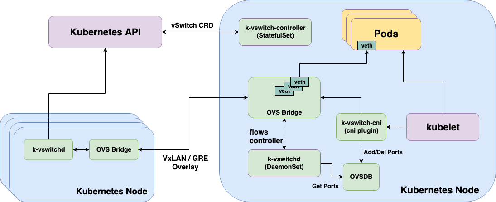

# Antrea Architecture

Antrea is designed to be Kubernetes-centric and Kubernetes-native. It focuses on and is optimized for networking and security of a Kubernetes cluster. Its implementation leverages Kubernetes and Kubernetes native solutions as much as possible.

Antrea leverages Open vSwitch as the networking data plane. Open vSwitch is a high-performance programmable virtual switch that supports both Linux and Windows. Open vSwitch enables Antrea to implement Kubernetes Network Policies in a high-performance and efficient manner. Thanks to the "programmable" characteristic of Open vSwitch, Antrea is able to implement an extensive set of networking and security features and services on top of Open vSwitch.

Some information in this document and in particular when it comes to the Antrea Agent is specific to running Antrea on Linux Nodes.

## Components

In a Kubernetes cluster, Antrea creates a Deployment that runs Antrea Controller, and a DaemonSet that includes two containers to run Antrea Agent and OVS daemons respectively, on every Node. The DaemonSet also includes an init container that installs the CNI plugin - antrea-cni - on the Node and ensures that the OVS kernel module is loaded and it is chained with the portmap and bandwidth CNI plugins. All Antrea Controller, Agent, OVS daemons, and antrea-cni bits are included in a single Docker image. Antrea also has a command-line tool called antctl, and an Octant UI plugin.

### Antrea controller

Antrea Controller watches NetworkPolicy, Pod, and Namespace resources from the Kubernetes API, computes NetworkPolicies and distributes the computed policies to all Antrea Agents. Right now Antrea Controller supports only a single replica. At the moment, Antrea Controller mainly exists for NetworkPolicy implementation. If you only care about connectivity between Pods but not NetworkPolicy support, you may choose not to deploy Antrea Controller at all. However, in the future, Antrea might support more features that require Antrea Controller.

Antrea Controller leverages the Kubernetes apiserver library to implement the communication channel to Antrea Agents. Each Antrea Agent connects to the Controller API server and watches the computed NetworkPolicy objects. Controller also exposes a REST API for antctl on the same HTTP endpoint. See more information about the Controller API server implementation in the Controller API server section.

### Controller API server

Antrea Controller leverages the Kubernetes apiserver library to implement its own API server. The API server implementation is customized and optimized for publishing the computed NetworkPolicies to Agents:

* The API server keeps all the state in in-memory caches and does not require a datastore to persist the data.
* It sends the NetworkPolicy objects to only those Nodes that need to apply the NetworkPolicies locally. A Node receives a NetworkPolicy if and only if the NetworkPolicy is applied to at least one Pod on the Node.
* It supports sending incremental updates to the NetworkPolicy objects to Agents.
* Messages between Controller and Agent are serialized using the Protobuf format for reduced size and higher efficiency.

The Antrea Controller API server also leverages Kubernetes Service for:

* Service discovery
* Authentication and authorization

The Controller API endpoint is exposed through a Kubernetes ClusterIP type Service. Antrea Agent gets the Service's ClusterIP from the Service environment variable and connects to the Controller API server using the ClusterIP. The Controller API server delegates authentication and authorization to the Kubernetes API - the Antrea Agent uses a Kubernetes ServiceAccount token to authenticate to the Controller, and the Controller API server validates the token and whether the ServiceAccount is authorized for the API request with the Kubernetes API.

Antrea Controller also exposes a REST API for antctl using the API server HTTP endpoint. It leverages Kubernetes API aggregation to enable antctl to reach the Antrea Controller API through the Kubernetes API - antctl connects and authenticates to the Kubernetes API, which will proxy the antctl API requests to the Antrea Controller. In this way, antctl can be executed on any machine that can reach the Kubernetes API, and it can also leverage the kubectl configuration (kubeconfig file) to discover the Kubernetes API and authentication information. See also the antctl section.

### Antrea agent

Antrea Agent manages the OVS bridge and Pod interfaces and implements Pod networking with OVS on every Kubernetes Node.

Antrea Agent exposes a gRPC service (Cni service) which is invoked by the antrea-cni binary to perform CNI operations. For each new Pod to be created on the Node, after getting the CNI ADD call from antrea-cni, the Agent creates the Pod's network interface, allocates an IP address, connects the interface to the OVS bridge and installs the necessary flows in OVS. To learn more about the OVS flows check out the OVS pipeline doc.

Antrea Agent includes two Kubernetes controllers:

* The Node controller watches the Kubernetes API server for new Nodes, and creates an OVS (Geneve / VXLAN / GRE / STT) tunnel to each remote Node.
* The NetworkPolicy controller watches the computed NetworkPolicies from the Antrea Controller API, and installs OVS flows to implement the NetworkPolicies for the local Pods.

Antrea Agent also exposes a REST API on a local HTTP endpoint for antctl.

## POD networking

### Pod interface configuration and IPAM

On every Node, Antrea Agent creates an OVS bridge (named br-int by default), and creates a veth pair for each Pod, with one end being in the Pod's network namespace and the other connected to the OVS bridge. On the OVS bridge, Antrea Agent also creates an internal port - antrea-gw0 by default - to be the gateway of the Node's subnet, and a tunnel port antrea-tun0 which is for creating overlay tunnels to other Nodes.

By default, Antrea leverages Kubernetes' NodeIPAMController to allocate a single subnet for each Kubernetes Node, and Antrea Agent on a Node allocates an IP for each Pod on the Node from the Node's subnet. NodeIPAMController sets the podCIDR field of the Kubernetes Node spec to the allocated subnet. Antrea Agent retrieves the subnets of Nodes from the podCIDR field. It reserves the first IP of the local Node's subnet to be the gateway IP and assigns it to the antrea-gw0 port, and invokes the host-local IPAM plugin to allocate IPs from the subnet to all Pods. A local Pod is assigned an IP when the CNI ADD command is received for that Pod.

NodeIPAMController can run in kube-controller-manager context, or within the context of Antrea Controller.

For every remote Node, Antrea Agent adds an OVS flow to send the traffic to that Node through the appropriate tunnel. The flow matches the packets' destination IP against each Node's subnet.

In addition to Kubernetes NodeIPAM, Antrea also implements its own IPAM feature, which can allocate IPs for Pods from user-defined IP pools.

### Traffic walk

* Intra-node traffic Packets between two local Pods will be forwarded by the OVS bridge directly.

* Inter-node traffic Packets to a Pod on another Node will be first forwarded to the antrea-tun0 port, encapsulated, and sent to the destination Node through the tunnel; then they will be decapsulated, injected through the antrea-tun0 port to the OVS bridge, and finally forwarded to the destination Pod.

* Pod to external traffic Packets sent to an external IP or the Nodes' network will be forwarded to the antrea-gw0 port (as it is the gateway of the local Pod subnet), and will be routed (based on routes configured on the Node) to the appropriate network interface of the Node (e.g. a physical network interface for a baremetal Node) and sent out to the Node network from there. Antrea Agent creates an iptables (MASQUERADE) rule to perform SNAT on the packets from Pods, so their source IP will be rewritten to the Node's IP before going out.

# k-vswitch

