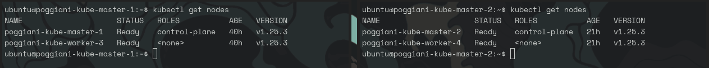

# Setup guide

## Master Node

Install the needed prerequisite:

```Shell
 sudo apt-get install ca-certificates curl gnupg lsb-release

 sudo mkdir -p /etc/apt/keyrings

 curl -fsSL https://download.docker.com/linux/ubuntu/gpg | sudo gpg --dearmor -o /etc/apt/keyrings/docker.gpg

 echo   "deb [arch=$(dpkg --print-architecture) signed-by=/etc/apt/keyrings/docker.gpg] https://download.docker.com/linux/ubuntu $(lsb_release -cs) stable" | sudo tee /etc/apt/sources.list.d/docker.list > /dev/null
```

Install docker and containerd, the runtime we're gonna use:

```Shell
 sudo apt update

 sudo apt-get install docker-ce docker-ce-cli containerd.io docker-compose-plugin
 ```

Install kubelet, kubeadm and kubectl:

```Shell
 curl -s https://packages.cloud.google.com/apt/doc/apt-key.gpg | sudo apt-key add -

 cat <<EOF | sudo tee /etc/apt/sources.list.d/kubernetes.list
 deb https://apt.kubernetes.io/ kubernetes-xenial main
 EOF

 sudo apt update

 sudo apt install kubectl kubeadm kubelet
```

Perform the `sudo kubeadm init`.
If it returns an error try:

```Shell
 rm /etc/containerd/config.toml
 systemctl restart containerd
 kubeadm init
```

Then make the cluster executable:

```Shell
  mkdir -p $HOME/.kube
  sudo cp -i /etc/kubernetes/admin.conf $HOME/.kube/config
  sudo chown $(id -u):$(id -g) $HOME/.kube/config
```

Install CNI (flannel is a CNI supported by LIQO):

```Shell
 kubectl apply -f https://raw.githubusercontent.com/flannel-io/flannel/master/Documentation/kube-flannel.yml
```

Install LIQOctl:

```Shell
 curl --fail -LS "https://github.com/liqotech/liqo/releases/download/v0.6.0/liqoctl-linux-amd64.tar.gz" | tar -xz
 sudo install -o root -g root -m 0755 liqoctl /usr/local/bin/liqoctl
```

Install LIQO:

```Shell
 liqoctl install kubeadm
```

Install Helm:

```Shell
 curl https://baltocdn.com/helm/signing.asc | gpg --dearmor | sudo tee /usr/share/keyrings/helm.gpg > /dev/null
 sudo apt-get install apt-transport-https --yes

 echo "deb [arch=$(dpkg --print-architecture) signed-by=/usr/share/keyrings/helm.gpg] https://baltocdn.com/helm/stable/debian/ all main" | sudo tee /etc/apt/sources.list.d/helm-stable-debian.list

 sudo apt-get update
 
 sudo apt-get install helm
```

### Minimum version required:
- containerd: 1.6.9
- runc:       1.1.4
- kubelet:    1.25.3
- kubeadm:    1.25.3
- kubectl:    1.25.3

## Worker node

Install CRIU:

```Shell
 echo 'deb http://download.opensuse.org/repositories/devel:/tools:/criu/xUbuntu_20.04/ /' | sudo tee /etc/apt/sources.list.d/devel:tools:criu.list

 curl -fsSL https://download.opensuse.org/repositories/devel:tools:criu/xUbuntu_20.04/Release.key | gpg --dearmor | sudo tee /etc/apt/trusted.gpg.d/devel_tools_criu.gpg > /dev/null

 sudo apt update

 sudo apt install criu
```

Install GO:

```Shell
 wget https://go.dev/dl/go1.19.3.linux-amd64.tar.gz

 sudo  rm -rf /usr/local/go && sudo tar -C /usr/local -xzf go1.19.3.linux-amd64.tar.gz

 export PATH=$PATH:/usr/local/go/bin
```

Install containerd, kubeadm, kubernetes-cni and kubelet as before.

Copy the `kubeadm join`.

### Minimum version required:
- criu:       3.17.1
- go:         1.19.3


 ## Final setup
 At the end of the configuration phase, we have a setup like this:

 